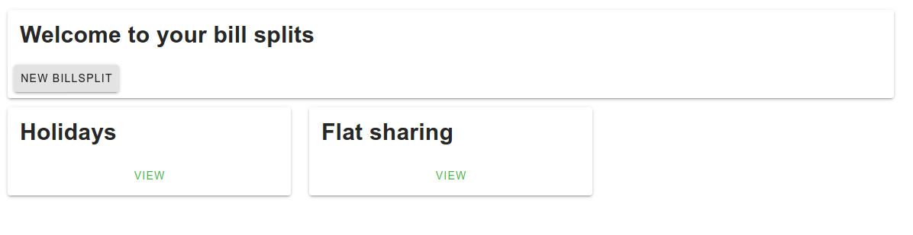
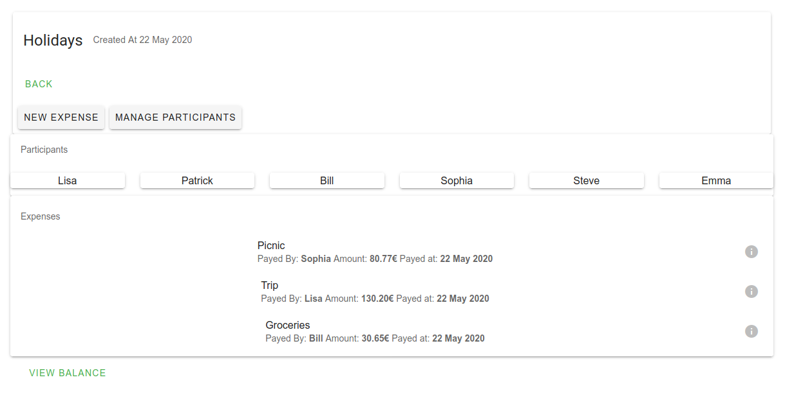
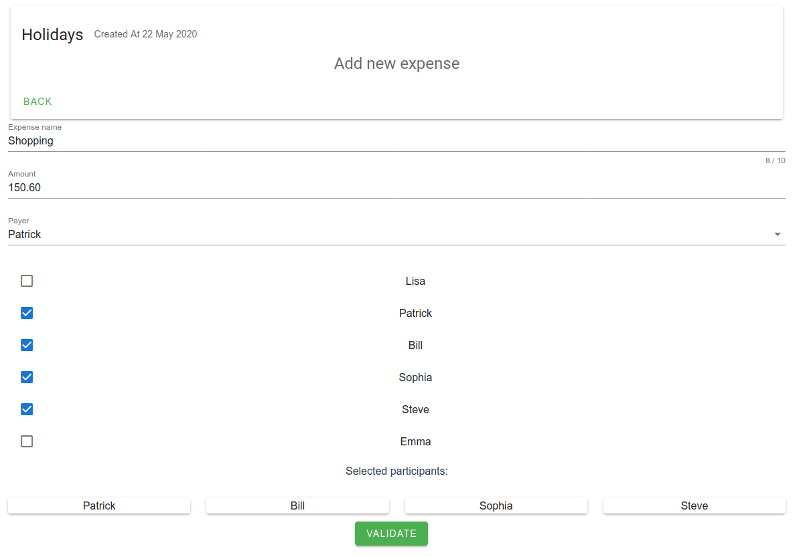
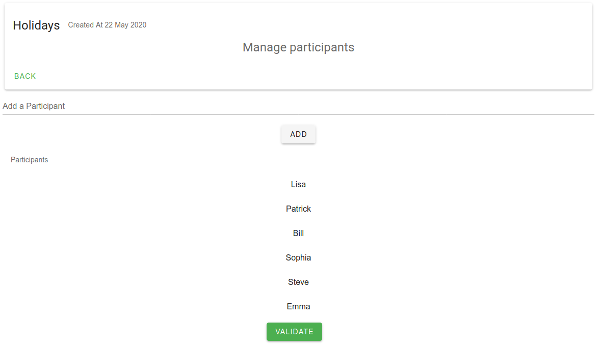
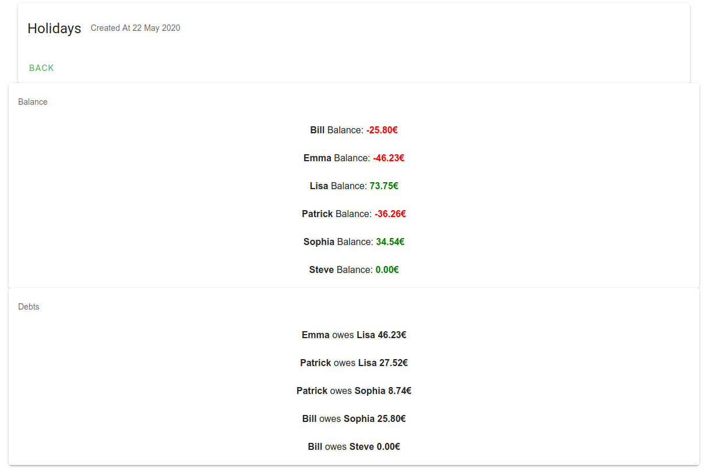

A simple bill splitting app with a Go backend and a Vuejs frontend communicating via a REST api.
Share expenses among friends easily by adding expenses to a bill split and automatically get the balance 
of each participant.

 
Features:
* View and add new bill splits



* View expenses associated to a bill split



* Add new expenses



* Add new participants to a bill split




* View balance of participants




## Requirements

The backend is written in Go and uses go modules (> go1.13).
The frontend uses Vuejs (Vuetify, axios, router)

## Backend build instructions

Backend serves at http://localhost:8010/

to build the backend run: `go build -o bill-split`

to run it:  `./bill-split`

## Frontend build instructions

Backend serves at http://localhost:8080/

##### Project setup
```
npm install
```

##### Compiles and hot-reloads for development
```
npm run serve
```


